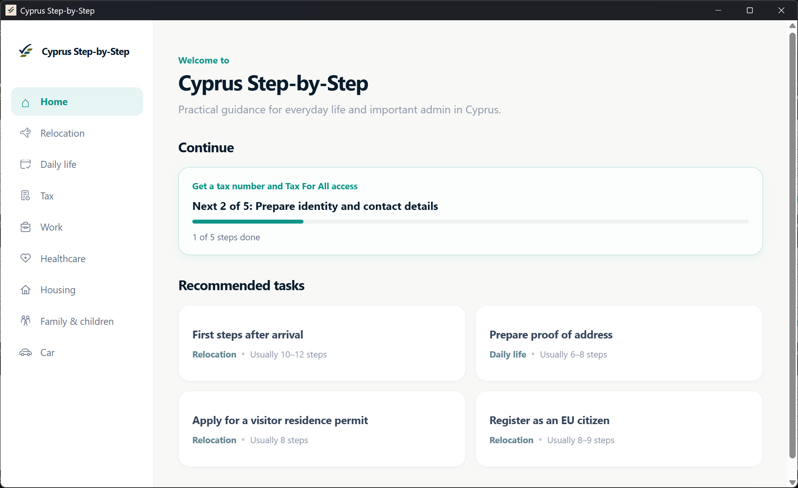

# Cyprus Step-by-Step Desktop

Cyprus Step-by-Step Desktop is a desktop prototype of Cyprus Step-by-Step built with Next.js, React, TypeScript, and Electron. It demonstrates a complete desktop vertical slice around one Cyprus tax scenario: getting a tax number and Tax For All access.



## Try the Windows build

Portable Windows builds are published in the repository's GitHub Releases. No installer is required: download the portable `.exe` and run it directly. Progress is persisted between launches, and the demo supports native Windows reminders.

The demo executable is currently unsigned, so Windows SmartScreen may show a warning.

## What the demo includes

- Persistent desktop navigation across categories and scenario states.
- Scenario details, a questionnaire, and personalized checklist generation.
- Checklist progress lifecycle and Step Details with official source links.
- Progress and reminders persisted across application restarts.
- Native step reminders, including restoration after restart.
- Keyboard-accessible modal focus behavior.
- Portable Windows packaging.

The current desktop prototype implements one complete scenario flow.

## Architecture

`React renderer → typed preload bridge → validated IPC → Electron main process`

### Renderer

The Next.js/React renderer uses a static export. Packaged production loads it locally with `file://`, so no local HTTP server is required. It owns UI navigation and renderer state, including pure checklist-personalization logic.

### Preload bridge

The preload layer exposes a narrow, typed `contextBridge` API for persistence, reminders, and opening source links. It does not expose raw `ipcRenderer` access.

### Electron main process

The main process owns filesystem persistence, IPC runtime validation, HTTPS-only external browser integration, reminder scheduling, Windows notification identity, and native notifications.

### Persistence

State is stored as JSON under Electron `userData`. Writes use a temporary file followed by rename. Persisted transitions complete before the renderer receives success, and reminder removal/completion ordering is designed to avoid UI and disk divergence.

`durable persisted transition → native timer or side effect → renderer success`

### Electron security boundary

Browser windows use `contextIsolation: true`, `nodeIntegration: false`, and `sandbox: true`. The application relies on narrow preload APIs, HTTPS-only external source handling, and runtime validation at IPC boundaries.

## Tech stack

- Next.js
- React
- TypeScript
- Electron
- Vitest
- electron-builder
- Prettier

## Development

Install the committed dependency set:

```powershell
npm ci
```

Run the Next.js renderer alone in development mode:

```powershell
npm.cmd run dev
```

Run Electron with the Next.js development server:

```powershell
npm.cmd run electron:dev
```

For a production-like Electron session, build the static renderer first, then start Electron in static mode. `electron:prod` compiles Electron code but expects the static `out` directory to already exist.

```powershell
npm.cmd run build
npm.cmd run electron:prod
```

### Development Windows notifications

Unpackaged Electron can need a Start Menu identity for reliable Windows notifications. To create the development-only shortcut once, use Command Prompt syntax:

```cmd
set ELECTRON_CREATE_NOTIFICATION_SHORTCUT=1&& npm.cmd run electron:dev
```

Recipients of the packaged portable executable do not need this step; the packaged build maintains its own Windows shortcut and identity automatically.

### Formatting and validation

```powershell
npm.cmd run format
npm.cmd run format:check
npm.cmd run typecheck
```

## Tests

Run the focused test suite with:

```powershell
npm.cmd test
```

The suite covers generic checklist conditional semantics, persistence-state transformations, and main-process scenario/IPC contract validation. It is deliberately focused rather than comprehensive; UI and native-notification flows are validated manually rather than through GUI automation.

## Build a portable Windows executable

```powershell
npm.cmd run package:win:portable
```

This runs the static renderer build, compiles Electron, and uses electron-builder to produce one x64 portable Windows `.exe` under `release`. It has no installer wizard and is intended to run without administrator privileges. Runtime progress remains under Electron `userData`.

### Portable Windows notification identity

The packaged portable build uses a stable AppUserModelID and Toast Activator CLSID. Before reminders are restored, it creates or refreshes a per-user Start Menu shortcut that targets the outer portable executable via `PORTABLE_EXECUTABLE_FILE`; launching the portable executable from a new location refreshes that shortcut.

## Prototype scope

This repository is a focused desktop prototype. One complete Cyprus Step-by-Step scenario is implemented, and the desktop demo is in English. Unsupported scenario cards may appear for context but are intentionally inert. Backend services and cloud synchronization are not part of this prototype.
